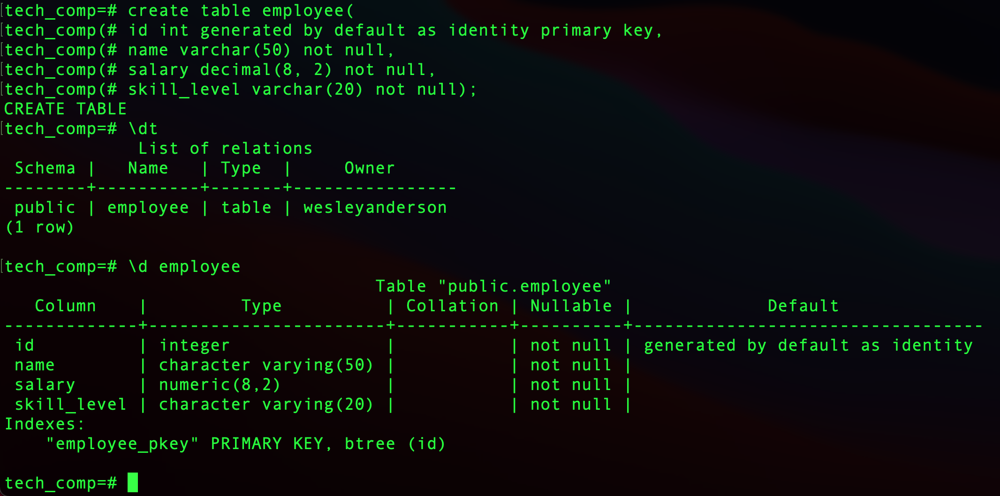
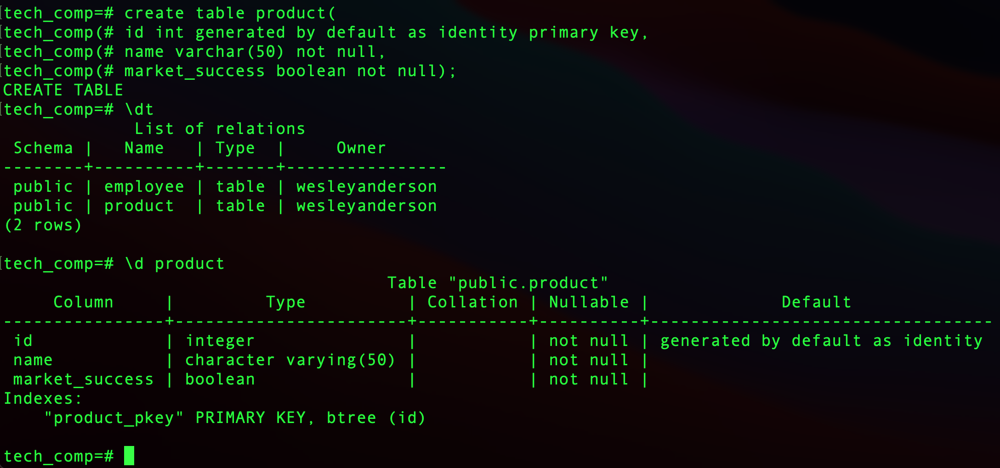
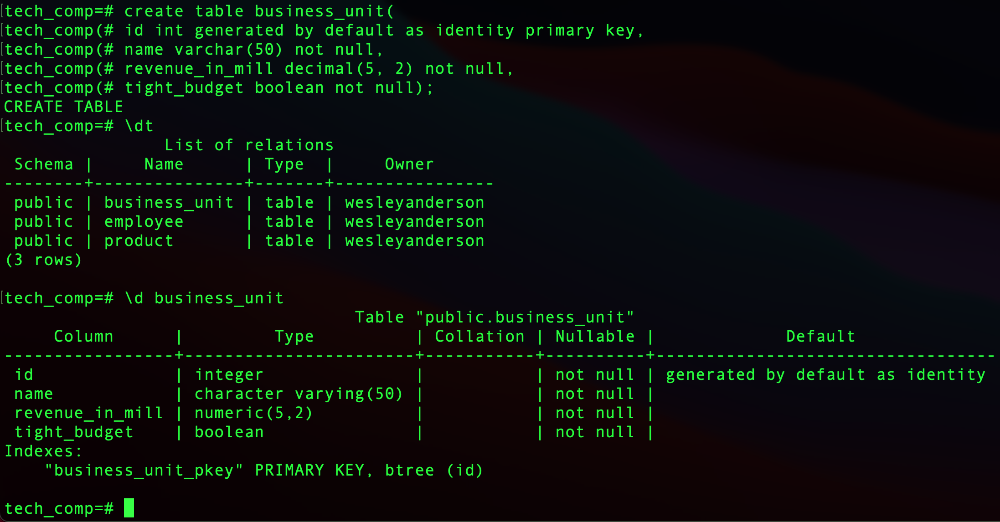
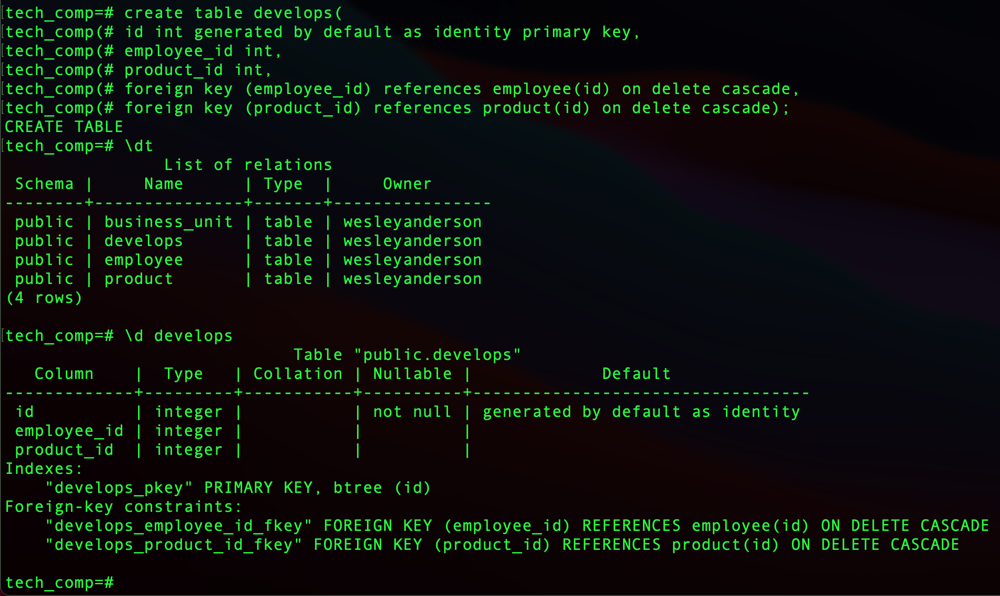
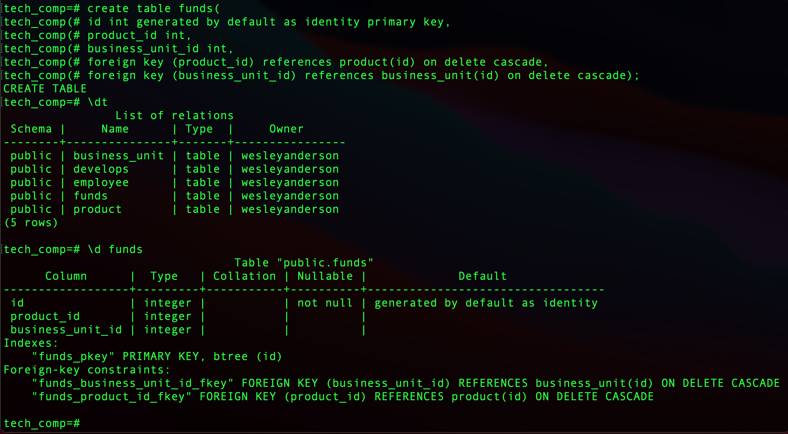
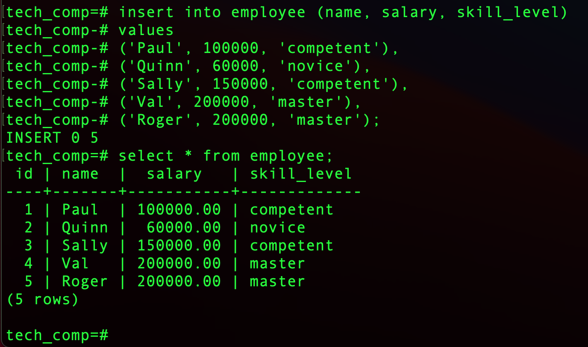
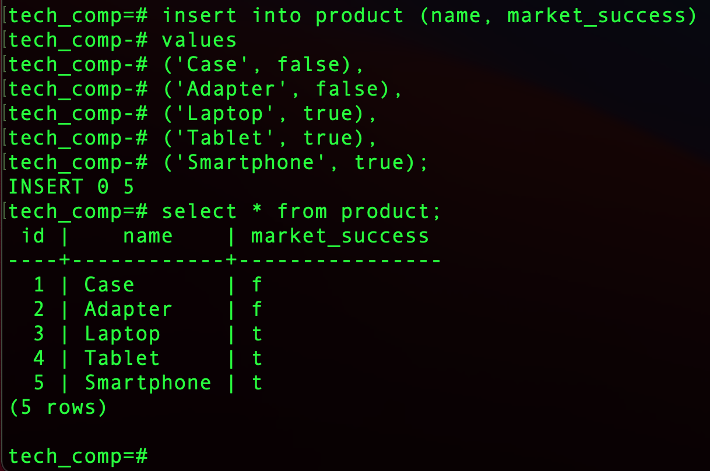
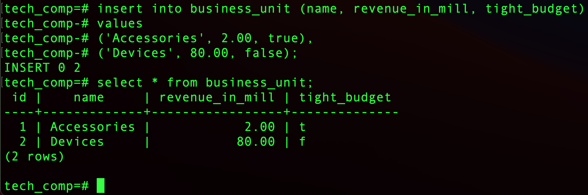
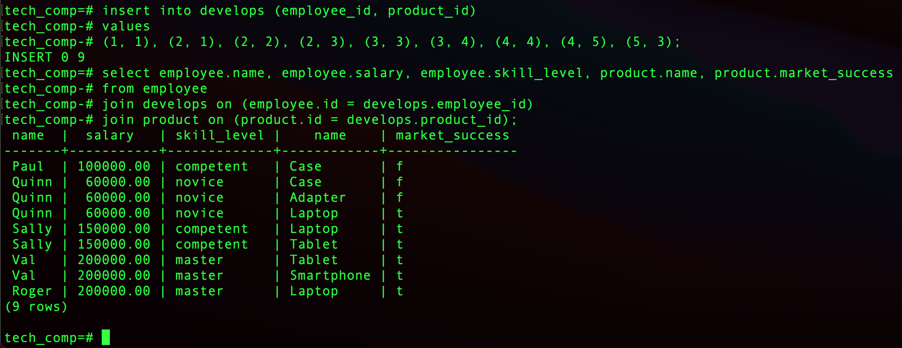
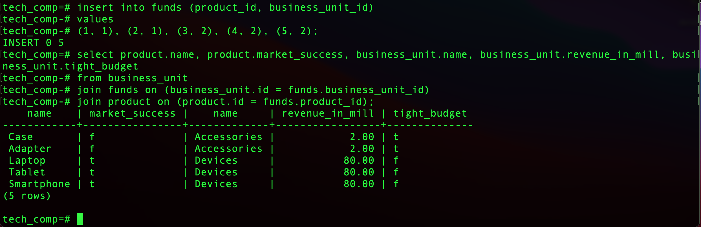

## It's Schemas All The Way Down...Until It Ain't!

#### Comprehending Schema Concepts

From the [public Launch School material](https://launchschool.com/books/sql/read/introduction):

> In simple terms, the relational model defines a set of relations (which we can think of as analogous to tables) and describes the relationships, or connections, between them in order to determine how the data stored in them can interact.

I realize the 'relation model' term comes from Codd. But, assuming I understand where Codd and the Launch School material are coming from, I believe the preferred term nowadays (at least in some circles) is 'relational schema' (which is not synonymous with 'relation schema', as we'll see). I think there are good reasons for this. Typically we think of models as being compared to some concrete system. But it's a bit strange to think of relational schemas as being compared to concrete systems, as they are just empty frameworks for scaffolding relational databases. Moreover, although 'model' is sometimes used to _prescribe_ as well as _describe_, I think 'schema' better connotes the idea that the purpose of a relational schema is first and foremost to _prescribe_ how we should structure and store our data of concrete systems. So, hereafter I drop the term 'relational model' in the hopes of making sense of relational schemas, database schemas, and relation schemas.

Often in the domain of relational databases, Entity-Relationship diagrams (ER diagrams) are used as descriptions of relational schemas. But ordinary English works as well. Here's an example:

> A tech company consists of employees, products, and business-units. Employees have a salary and a skill-level, products are either successful or not, and business-units have revenue and either a tight budget or not. An employee can work on many products, and a product can be worked on by many employees. In addition, a business-unit can be funded by many products. However, a product funds at most one business-unit.

Our tech company description at least partially specifies a relational schema. But to create a full-blown relational schema for a model of a tech company, we need to ensure that our relational schema consists of _three_ essential features.

_First_, our relational schema must contain a set of _classes_. Let's denote these by '**I**'. The set **I** is typically and usefully partitioned into **E**, the set of entity classes, and **R**, the set of relationship classes. What are these? Here is a rough way of thinking about classes, generally:

> A class of a property is the extension of the property. A class contains all and only items that have the property.

Consider first the _entity_ classes. In this example, the employee class, the product class, and the business-unit class are the elements of **E**. The _employee_ class is an abstract object that is the extension of the concrete property of _being an employee entity_. You may accordingly think of it as the set of concrete employees at our tech company. We may say similar things about the product class (and the corresponding property of _being a product entity_) and the business-unit class (and the corresponding property of _being a business-unit entity_).

Let's not forget about the _relationship_ classes. In our example, the develops class and the funds class are the elements of **R**. The _develops_ class is an abstract object that is the extension of the concrete property of _being a develops relationship_. You may accordingly think of it as the set of concrete employee-product pairs that are develops-related. We may say similar things about the funds class (and the corresponding property of _being a funds relationship_).

_Second_, our schema is a _relational_ schema because it contains a database schema! In particular, the database schema contains a relation schema for each class. Each relation schema specifies the set of attributes for the class.[1] More precisely, the relation schema picks out a proper subset of the Cartesian product of the following three sets:

> {set of identifiers}, {set of data types}, {set of sets of constraints}

The Cartesian product over those three sets is just the set of all ordered triples

> \<x, y, Z\>

where _x_ is of a set of identifiers, _y_ is of a set of data types, and _Z_ is of a set of sets of constraints. A relation schema picks out a proper subset of _that_ Cartesian product. Because a relation (over sets) is just a subset of a Cartesian product, the relation schema picks out a relation over the above three sets. So, for example, a Cartesian product relevant for our _product_ class is the set of all the ordered triples \<_x_, _y_, _Z_\>, where

- _x_ is of {"`id`", "`name`", "`market_success`"},
- _y_ if of {`integer`, `boolean`, `varchar(20)`, ...}, and
- _Z_ is of {{`unique`}, {`unique`, `not null`}, ..., {`primary key`}, ...}}.

A relation schema for _product_, in turn, would be a proper subset of that Cartesian product. Each such ordered triple in the set picked out by the _product_ relation schema is an attribute of _product_. We may say similar things about our other classes, including our relationship classes. For example, a relation schema for _funds_ yields a proper subset of the set of all ordered triples \<_x_, _y_, _Z_\>, where

- _x_ is of {"`id`", "`product_id`", "`business_unit_id`"},
- _y_ if of {`integer`, `boolean`, `varchar(20)`, ...}, and
- _Z_ is of {{`unique`}, {`unique`, `not null`}, ..., {`primary key`}, ...}}.

The set of such ordered triples would be the attributes of _funds_.

The _third_ ingredient of our _relational_ schema is that it contains some cardinality constraints.[2] These are given by a function. To get a better idea of this, let me be a bit more precise about functions. A 2-place relation _Q_ (over sets) is a unary total function whenever, for every argument _x_ of set _X_, there is a unique return value _y_ of set _Y_ such that _x_ is _Q_-related to _y_. More generally,

> An _n'_-place relation _Q_ is a total function with _n_-arity whenever, for all arguments _x1 of X1, ..., xn of Xn_, there is a unique return value _y_ of _Y_ such that _x1, ..., xn, y_ exemplify _Q_.

In our case, a `card` function is a binary total function such that the first argument is any _R_ of **R**. The second argument is one of _R_'s entity classes _E_. Given any two such arguments, there is a unique return value of the set _{ONE, MANY}_. The value returned depends on how many instances of _R_ within which _an_ instance of _E_ _can_ participate. Hence a `card` gives us our relational schema's cardinality constraints.

In sum, our relational schema is identical to the abstract object that contains a set of classes **I**, a database schema (or set of relation schemas), and a `card`. Let's come back to the quote we began with:

> In simple terms, the relational model defines a set of relations (which we can think of as analogous to tables) and describes the relationships, or connections, between them in order to determine how the data stored in them can interact.

Given the above, I'd rewrite this as:

> The relational schema (1) contains a set of entity classes and relationship classes, (2) defines a relation schema (which, as with the relations that satisfy a relation schema, can be represented by a table) for each entity and relationship class, and (3) describes the cardinality of the relationships between entities. The relational schema better allows us to organize and structure our databases of the system of interest.

#### Implementing Our Relational Schema In PSQL

To put this understanding into practice, let's walk through implementing a relational schema for a relational database of the tech corporation in psql. Fire up psql. Create and connect to a `tech_comp` database. Our relational schema for our tech company database is such that the set of entity classes is composed of _employee_, _product_, and _business-unit_. We know that we need to implement a relation schema for each of those entity classes. Starting with _employee_, the _employee_ relation schema must pick out a proper subset of the set of all the ordered triples \<_x_, _y_, _Z_\>, where _x_ is of {"`id`", "`name`", "`salary`", "`skill_level`"}, _y_ is of {`integer`, `boolean`, `varchar(20)`, ...}, and _Z_ is of {{`unique`}, {`unique`, `not null`}, ..., {`primary key`}, ...}}. Let's suppose the _employee_ relation schema picks the following proper subset of all such ordered triples:

- {\<"`id`", `integer`, {`generated by default as identity`, `primary key`}\>,
- \<"`name`", `varchar(50)`, {`not null`}\>,
- \<"`salary`", `decimal(8, 2)`, {`not null`}\>,
- \<"`skill_level`", `varchar(20)`, {`not null`}\>}

In psql, we have:



Let's assume our _product_ relation schema picks out:

- {\<"`id`", `integer`, {`generated by default as identity`, `primary key`}\>,
- \<"`name`", `varchar(50)`, {`not null`}\>,
- \<"`market_success`", `boolean`, {`not null`}\>}

In psql, we have:



Finally, let's assume our _business-unit_ relation schema picks out:

- {\<"`id`", `integer`, {`generated by default as identity`, `primary key`}\>,
- \<"`name`", `varchar(50)`, {`not null`}\>,
- \<"`revenue_in_mill`", `decimal(5, 2)`, {`not null`}\>,
- \<"`tight_budget`", `boolean`, {`not null`}\>}

In psql, we have:



That's all there is to implementing our relation schemas for our entity classes following our pre-defined relational schema. Now let's implement the relation schemas for our relationship classes: _develops_ and _funds_. Let's assume our _develops_ relation schema yields:

- {\<"`id`", `integer`, {`generated by default as identity`, `primary key`}\>,
- \<"`employee_id`", `integer`, {`foreign key references employee(id)`, `on delete cascade`}\>,
- \<"`product_id`", `integer`, {`foreign key references product(id)`, `on delete cascade`}\>}

In psql, we have:



Moreover, let's assume our _funds_ relation schema yields:

- {\<"`id`", `integer`, {`generated by default as identity`, `primary key`}\>,
- \<"`product_id`", `integer`, {`foreign key references product(id)`, `on delete cascade`}\>,
- \<"`business_unit_id`", `integer`, {`foreign key references business_unit(id)`, `on delete cascade`}\>}

In psql, we have:



As far as our relational schema goes, the only thing left to implement is a `card` function. It is a good idea to have a complete relational schema before constructing relations that satisfy our database schema willy-nilly. So, let's specify a `card`. Here's the `card` we'll use:

```text
// an employee can participate in many instances of develops
card(develops, employee) = MANY;

// a product can participate in many instances of develops
card(develops, product) = MANY;

// a product can participate in at most one instance of funds
card(funds, product) = ONE;

// a business-unit can participate in many instances of funds
card(funds, business-unit) = MANY;
```

So, the _develops_ relationship between _employee_ and _product_ is many-many, and the _funds_ relationship between _product_ and _business-unit_ is one-many.[3] In psql, we can enforce that _funds_ is one-many by ensuring that the `product_id` attribute has a `unique` constraint.

#### Beyond Schemas

Now that we've specified a relational schema for our tech company's model or database let's go ahead and construct some relations for each item class in psql. Here are two criteria for our relations:

1. Each relation _must_ satisfy its corresponding relation schema, and
2. The relations of relationship classes _should_ adhere to the cardinality constraints of our relational schema.

Let's start by creating a relation for _employee_. We have four sets of values:

> {sets of ids}, {sets of names}, {sets of salaries}, {sets of skill-levels}

To construct an _employee_ relation, we already know that we need to insert a subset of all such ordered quadruples. But we also know that we need our _employee_ relation to satisfy our _employee_ relation schema. We need to make sure, for example, that each `name` is no longer than 50 characters but not null and that each `salary` is not null but a decimal with 8 precision and 2 scale (for all such constraints, scroll back up to our _employee_ relation schema). Here's an example of the right kind of relation in psql:



We can do something similar to construct our other relations in psql. Here's our _product_ relation:



As far as entity classes go, here's our final relation that correspond to an entity class:



To construct relations for _develops_ and _funds_, not only do we both (a) need a subset of the relevant Cartesian product, and (b) need to ensure it satisfies the relevant relation schema, but we also (c) should ensure that the relations adhere to our pre-specified cardinality constraints. For our _develops_ relation, we said it could be many-many. Here's an example that works with `name`s rather than `id`s:

- {\<'Paul', 'Case'\>,
- \<'Quinn', 'Case'\>,
- \<'Quinn', 'Adapter'\>,
- \<'Quinn', 'Laptop'\>,
- \<'Sally', 'Laptop'\>,
- \<'Sally', 'Tablet'\>,
- \<'Val', 'Tablet'\>,
- \<'Val', 'Smartphone'\>,
- \<'Roger', 'Laptop'\>}

In psql, we have:



On the other hand, for our _funds_ relation, we said it had to be one-many. Here's an example that works with `name`s rather than `id`s again:

- {\<'Case', 'Accessories'\>,
- \<'Adapter', 'Accessories'\>,
- \<'Laptop', 'Devices'\>,
- \<'Tablet', 'Devices'\>,
- \<'Smartphone', 'Devices'\>},

In psql, we have:



We finished our first relational database with psql and hopefully clarified a bunch of concepts along the way! Hooray!

--------

[1]: In this domain, 'attribute' is a technical term. Besides the fact that an attribute is an ordered triple, I haven't fully worked out the significance of 'attribute'. Suppose we have the following attribute: \<"`height`", `integer`, {`not null`}\>. Does this represent a kind of property, or does this represent a condition on properties? If the former is true, there is some _F_  that exemplifies _being a height property_. The height attribute would represent the property of _being a height property_. If the latter is true, _F_ is a height just in case the following conditions are satisfied: Φ. The height attribute would represent Φ. This matters inferentially and conceptually. Do we really understand 'attribute' if we do not know how to make inferences with sentences that contain the term? Whether an attribute is a kind or a condition, will have inferential consequences.

[2]: We could also include modality constraints (necessity/possibility), but I'll leave this aside here.

[3]: The term 'instance' is overloaded in the literature. Sometimes _relations_ are said to be 'instances of' a relation schema. But I think this not strictly correct. Relations might satisfy a relation schema, but I don't think they instantiate it. A relation satisfies a relation schema whenever, for each attribute, there is a unique value of every element (represented by a tuple or row) of the relation that satisfies the data type and constraints of the attribute, and, for each value of every element of the relation, there is a unique attribute for which the value satisfies the data type and constraints of the attribute. _There must be a one-to-one correspondence between an attribute and a 'slot' of each element of the relation._ I think it is best to save the 'instance' talk for class instantiations. An _item_ is an instance of class _G_ whenever the item is a _G_. For example, Paul is an instance of _employee_ just in case Paul exemplifies the property of _being an employee entity_. Furthermore, \<Tablet, Devices\> is an instance of _funds_ just in case \<Tablet, Devices\> exemplifies the property of _being a funds relationship_. Finally, note that the ordinary relation \<Tablet, Devices\> is represented by \<'Tablet', 'Devices'\> or with the proper surrogate keys in psql. But \<'Tablet', 'Devices'\> is, of course, not identical to \<Tablet, Devices\>. The same can be said about ordinary entity instance Paul versus Paul's representation---'Paul'--- in psql. I think it's important to be clear about our referents. In the current context, the instance of a class is not a string, word, noun, verb, or any such thing!
